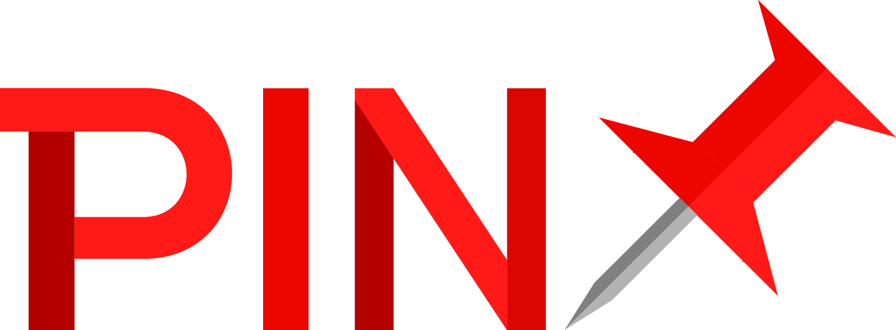

# Welcome to PIN: Public Index Network


> "The vision we have for PIN is to become the public index for a metadata network. PIN isn't a smart contract platform plus 'oh we also have metadata on the side.' Metadata is PIN's purpose." 
>
> **— Joseph Fiscella, PIN Core Developer**



**Latest News**: [**FLO Rebrand**](https://medium.com/@JosephFiscella/d3b679b8f6ab)📌


\*\*\*\*

